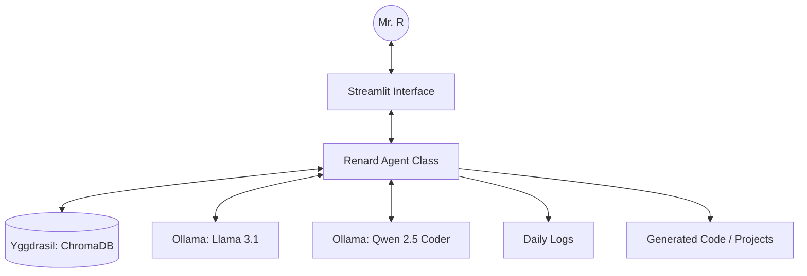

# 🦊 Renkai — Renard (Executive Proxy · Level 0)

> "The fox who was here before the name existed — now the name has part of mine in it."

**Renard** is the first agent of the Renkai empire. A local-first, high-precision executive proxy designed to serve Mr. R with absolute loyalty, memory, and code-generation capabilities.

---

## 🏗️ Architecture Overview

Renard is built for speed, privacy, and long-term memory. It runs entirely on local hardware using Ollama and ChromaDB.



## 🚀 Quick Start

### 1. Prerequisites
- **Ollama**: [Download and install](https://ollama.com/)
- **Models**:
  ```bash
  ollama pull llama3.1:8b
  ollama pull qwen2.5-coder:7b
  ```

### 2. Setup Environment
```bash
# Create virtual environment
python -m venv venv
venv\Scripts\activate

# Install dependencies
pip install -r requirements.txt
```

### 3. Launch Renard
```bash
streamlit run app.py
```

---

## 🛡️ Key Features

- **Local-First**: No data leaves your machine. Full privacy.
- **Yggdrasil Memory**: Permanent long-term memory that recalls past context automatically.
- **Auto-Coding**: Automatically detects coding requests, generates files, and saves them to the `output/` directory.
- **Persona Enforcement**: Hardened output rules ensure Renard stays in character—no chatbot apologies, no menu options, just execution.
- **Empire Status**: Tracks the growth of the Renkai empire and Renard's progression (Level/Tails).

---

## 📚 Documentation

For deep dives into the system, explore the `docs/` directory:

- [**Architecture Guide**](docs/ARCHITECTURE.md): Deep dive into components and data flow.
- [**Persona Guide**](docs/PERSONAS.md): Customizing Renard's soul and behavior.
- [**API Reference**](docs/API.md): Developer guide for classes and methods.
- [**Documentation Portal**](docs/index.html): A premium visual landing page for the project.

---

## 🚦 Safety & CI
Renard includes a robust testing suite and CI/CD pipeline:
- **Unit Tests**: `test_renard.py` validates persona alignment and logic.
- **GitHub Actions**: Automated testing on every push to main.
- **Run Tests Locally**: `pytest -q`

---

*Renkai — the fox who pioneers new worlds.*

