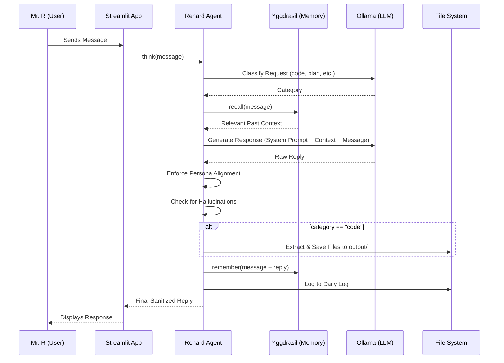

# Architecture Guide: Renkai — Renard

This document provides a detailed overview of the technical architecture of Renard, the Executive Proxy of the Renkai empire.

## Overview

Renard is a local AI agent system designed for high-performance task execution and long-term memory. It leverages the following core technologies:

| Component | Technology | Role |
| :--- | :--- | :--- |
| **User Interface** | Streamlit | Web-based chat interface |
| **Agent Logic** | Python | Orchestration, persona enforcement, and tool use |
| **Brain (Thinking)** | Ollama (Llama 3.1) | General reasoning and planning |
| **Builder (Coding)**| Ollama (Qwen 2.5 Coder) | Specialized code generation |
| **Memory (Yggdrasil)**| ChromaDB | Vector database for long-term semantic memory |

---

## Data Flow

The following diagram illustrates how data flows through the system when Mr. R sends a message.

---

## Component Details

### 1. Renard Agent (`renard.py`)
The "brain" of the orchestration. It manages:
- **Persona Loading**: Loads configuration from `personas/renard.yaml`.
- **Classification**: Determines the intent of the user request to select the appropriate LLM model.
- **Sanitization**: Post-processes LLM output to remove "AI-isms" (e.g., "Next step:", "How may I assist you?").
- **Code Extraction**: Parses markdown code blocks and automatically writes them to disk.

### 2. Yggdrasil Memory (`yggdrasil.py`)
Named after the world tree, this component is the "soul" of the empire.
- **Semantic Search**: Uses ChromaDB to store and retrieve conversations based on meaning, not just keywords.
- **Persistent Storage**: Data is saved locally in the `./memory/` directory.

### 3. Tools (`tools.py`)
A collection of utility functions:
- **File Management**: Writing generated code to the `output/` folder.
- **Empire Status**: Tracking the current state of the Renkai empire (number of agents, levels, etc.).
- **Logging**: Maintaining a human-readable text log of all interactions in `./logs/`.

### 4. Personas (`personas/`)
Configuration files that define the agent's identity, capabilities, and rules. This allows for easy extension of the system with new agent types as the empire grows.

---

## Security & Privacy
- **100% Local**: No API keys are required for the brain or memory.
- **No External Calls**: Unless explicitly added via tools, Renard does not communicate with the outside world.
- **Audit Logs**: Every interaction is logged for review.
